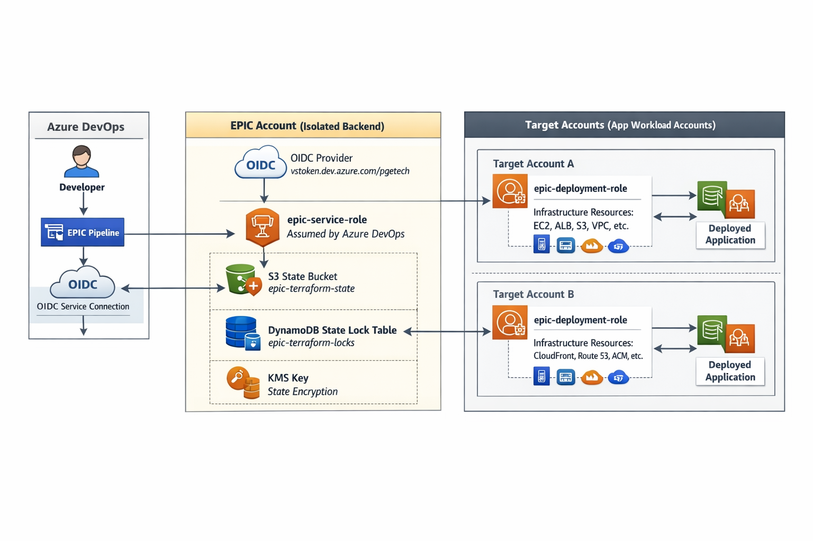

# EPIC Pipeline Architecture

## Overview

EPIC is PG&E's centralized enterprise pipeline for deploying infrastructure and applications across multiple AWS accounts. It provides a single, unified deployment platform that handles Terraform state management, infrastructure provisioning, and application deployment while maintaining security and isolation between accounts.

---



---

## Architecture Components

### EPIC Account (Isolated Backend)

The EPIC account is a dedicated, isolated AWS account that serves as the central control plane for all infrastructure deployments. It contains:

- **Terraform State Backend**
  - S3 bucket (`epic-terraform-state`) - stores all Terraform state files for every project across all accounts
  - DynamoDB table (`epic-terraform-locks`) - provides state locking to prevent concurrent modifications
  - KMS key - encrypts state files at rest

- **EPIC Service Role** (`epic-service-role`)
  - Primary identity that Azure DevOps pipelines assume
  - Has permissions to read/write Terraform state in EPIC account
  - Has permissions to assume deployment roles in target accounts
  - Configured with OIDC federation for passwordless authentication from Azure DevOps

- **OIDC Provider**
  - Federation endpoint for Azure DevOps (`vstoken.dev.azure.com/pgetech`)
  - Allows ADO pipelines to authenticate to AWS without static credentials
  - Uses Web Identity tokens for secure, temporary access

### Target Accounts (Application Workload Accounts)

Each target account represents an AWS account where applications and their infrastructure will be deployed. Each contains:

- **EPIC Deployment Role** (`epic-deployment-role`)
  - Trust relationship allows `epic-service-role` from EPIC account to assume it
  - Granted full permissions to provision infrastructure (EC2, VPC, ALB, S3, CloudFront, Route53, RDS, etc.)
  - Granted permissions to deploy applications (S3 uploads, SSM commands, CloudFront invalidations)

- **Application Infrastructure**
  - EC2 instances, Load Balancers, VPCs, Security Groups
  - S3 buckets, CloudFront distributions
  - Route53 DNS records, ACM certificates
  - Secrets Manager, Parameter Store
  - Any other AWS resources needed for the application

- **Deployed Applications**
  - Web frontends (Angular, React, etc.)
  - API backends (.NET Core, Python, etc.)
  - Static assets
  - Application code and artifacts

### Azure DevOps

- **EPIC Pipeline**
  - Single, centralized pipeline template used by all projects
  - Accepts configuration file defining infrastructure and application requirements
  - Orchestrates the entire deployment flow
  - Uses service connection configured for OIDC federation to EPIC account

## Deployment Flow

### 1. Developer Initiation

Developer triggers the EPIC pipeline in Azure DevOps, providing:
- Configuration file specifying infrastructure requirements
- Target AWS account ID
- Application code/artifacts
- Environment settings (dev, prod, etc.)

### 2. Authentication

- ADO pipeline authenticates to AWS using OIDC federation (no static credentials)
- ADO assumes `epic-service-role` in EPIC account using Web Identity token
- Temporary AWS credentials are issued for the pipeline run

### 3. Terraform State Management

Pipeline configures Terraform backend to use EPIC account resources:

```hcl
backend "s3" {
  bucket         = "epic-terraform-state-dev"
  key            = "projects/myapp/terraform.tfstate"
  region         = "us-west-2"
  dynamodb_table = "epic-terraform-locks-dev"
  encrypt        = true
  kms_key_id     = "arn:aws:kms:..."
  role_arn       = "arn:aws:iam::123456789012:role/epic-service-role"
}
```

- Terraform reads existing state from S3 (if exists)
- DynamoDB lock acquired to prevent concurrent modifications

### 4. Cross-Account Assumption

- `epic-service-role` assumes `epic-deployment-role` in target account
- AWS STS issues temporary credentials for target account
- All subsequent Terraform operations use target account credentials

### 5. Infrastructure Provisioning

- Terraform plans infrastructure changes based on configuration
- Developer reviews plan (optional, depending on approval gates)
- Terraform applies changes to target account:
  - Creates/updates VPC, subnets, security groups
  - Provisions EC2 instances, load balancers
  - Configures CloudFront, Route53, ACM certificates
  - Sets up S3 buckets, IAM roles, Secrets Manager
- Updated state written back to S3 in EPIC account
- DynamoDB lock released

### 6. Application Build

- Pipeline builds application artifacts
- Runs unit tests, integration tests
- Performs security scanning (SAST, dependency checks)
- Creates deployment packages (zip, container images, etc.)

### 7. Application Deployment

- Pipeline uploads artifacts to S3 in target account
- Deploys code to EC2 instances (via SSM, user data updates, etc.)
- Updates CloudFront distributions and invalidates caches
- Runs smoke tests to verify deployment
- Performs health checks on deployed services

### 8. Completion

- Pipeline reports success/failure
- Deployment artifacts and logs archived
- State remains locked in S3 for future operations

## Security Model

### Authentication Chain

```
Azure DevOps (OIDC) 
  → epic-service-role (EPIC Account)
    → epic-deployment-role (Target Account)
      → Provision Infrastructure & Deploy Apps
```

### Trust Boundaries

- **ADO → EPIC Account**: OIDC federation with audience and subject validation
- **EPIC Account → Target Account**: IAM role assumption with explicit ARN trust
- **No direct access**: Developers never have direct AWS credentials; all access flows through EPIC

### Isolation

- Target accounts are fully isolated from each other
- Applications cannot access resources in other target accounts
- EPIC account has no application workloads (only state management)
- State files in S3 are encrypted with KMS
- DynamoDB lock table prevents race conditions

### Least Privilege

- `epic-service-role` can only: manage state, assume target roles
- `epic-deployment-role` can only: provision infrastructure, deploy apps (cannot modify EPIC account or other target accounts)
- OIDC tokens are scoped to specific ADO projects/repos

## State Management

### Centralized State Storage

All Terraform state files are stored in the EPIC account S3 bucket with the following structure:

```
epic-terraform-state-dev/
├── projects/
│   ├── app1/
│   │   └── terraform.tfstate
│   ├── app2/
│   │   └── terraform.tfstate
│   └── app3/
│       ├── dev/terraform.tfstate
│       └── prod/terraform.tfstate
```

### State Locking

- DynamoDB table prevents concurrent Terraform operations on the same state file
- Lock includes: state file path, operation ID, timestamp, who locked it
- Locks automatically released after operation completes
- Force-unlock available for stuck locks (use with caution)

### State File Security

- Encrypted at rest using KMS
- Versioning enabled (can recover from accidental deletions/corruptions)
- Old versions expire after 90 days
- Access logged to CloudTrail
- Only `epic-service-role` can read/write state

## Onboarding a New Target Account

### Prerequisites

1. Target AWS account created and accessible
2. EPIC service role ARN from EPIC account

### Steps

1. **Deploy epic-target-bootstrap**

```bash
cd epic-target-bootstrap
terraform init
terraform plan -var="epic_service_role_arn=arn:aws:iam::111111111111:role/epic-service-role"
terraform apply
```

2. **Verify role creation**
   - Confirm `epic-deployment-role` exists in target account
   - Verify trust policy allows EPIC service role to assume it

3. **Configure application**
   - Create EPIC configuration file for application
   - Specify target account ID
   - Define infrastructure requirements

4. **Run EPIC pipeline**
   - Commit configuration to repository
   - Trigger EPIC pipeline
   - Pipeline will automatically provision infrastructure and deploy application

### One-Time Setup Per Account

The `epic-target-bootstrap` deployment is a **one-time operation** per AWS account. After the `epic-deployment-role` is created, EPIC can manage everything else in that account. No further manual setup required.

## Benefits

### For Developers

- **Single pipeline**: No need to learn multiple deployment tools or processes
- **Self-service**: Provide config file, EPIC handles everything
- **No credential management**: OIDC federation eliminates static credentials
- **Consistent deployments**: Same pipeline for all apps ensures standardization

### For Cloud Operations

- **Centralized state management**: All Terraform state in one secure location
- **Audit trail**: All deployments tracked through EPIC pipeline logs
- **Security**: Role-based access, no long-lived credentials, least privilege
- **Governance**: Enforce standards, policies, and compliance checks in pipeline

### For the Organization

- **Cost efficiency**: Shared infrastructure reduces duplication
- **Faster onboarding**: New projects deploy in minutes, not days
- **Reduced risk**: Standardized, tested deployment patterns
- **Scalability**: Easily support hundreds of applications across dozens of accounts

## Comparison to Previous Architecture

### Before EPIC

- Each target account had its own ADO provider role
- ADO service connection directly assumed role in target account
- State files scattered across multiple S3 buckets in different accounts
- No centralized locking mechanism
- Developers managed their own pipelines

### With EPIC

- Single OIDC provider in EPIC account
- Single service role with cross-account assume capability
- All state centralized in EPIC account with proper locking
- Unified pipeline reduces complexity and duplication
- Developers focus on code, EPIC handles deployment

## Troubleshooting

### Common Issues

**Pipeline fails to assume epic-service-role**
- Verify OIDC provider exists in EPIC account
- Check ADO service connection configuration
- Ensure audience and subject conditions match in trust policy

**Cannot assume epic-deployment-role in target account**
- Verify `epic-deployment-role` exists in target account
- Check trust policy includes correct `epic-service-role` ARN
- Ensure cross-account assume policy attached to `epic-service-role`

**Terraform state locked**
- Check DynamoDB lock table for stuck locks
- Verify previous pipeline run completed or failed cleanly
- Use `terraform force-unlock` if necessary (with caution)

**Permission denied during infrastructure provisioning**
- Verify `epic-deployment-role` has required IAM policies
- Check resource-level permissions if restricting by tags/paths
- Review CloudTrail logs for specific denied API calls

## Future Enhancements

- **Multi-region support**: Deploy to multiple AWS regions simultaneously
- **Approval gates**: Required manual approval before production deployments
- **Rollback automation**: Automatic rollback on deployment failures
- **Cost tracking**: Tag-based cost allocation per application
- **Drift detection**: Scheduled scans to detect infrastructure drift
- **Policy enforcement**: Automated checks for security, compliance, tagging standards
