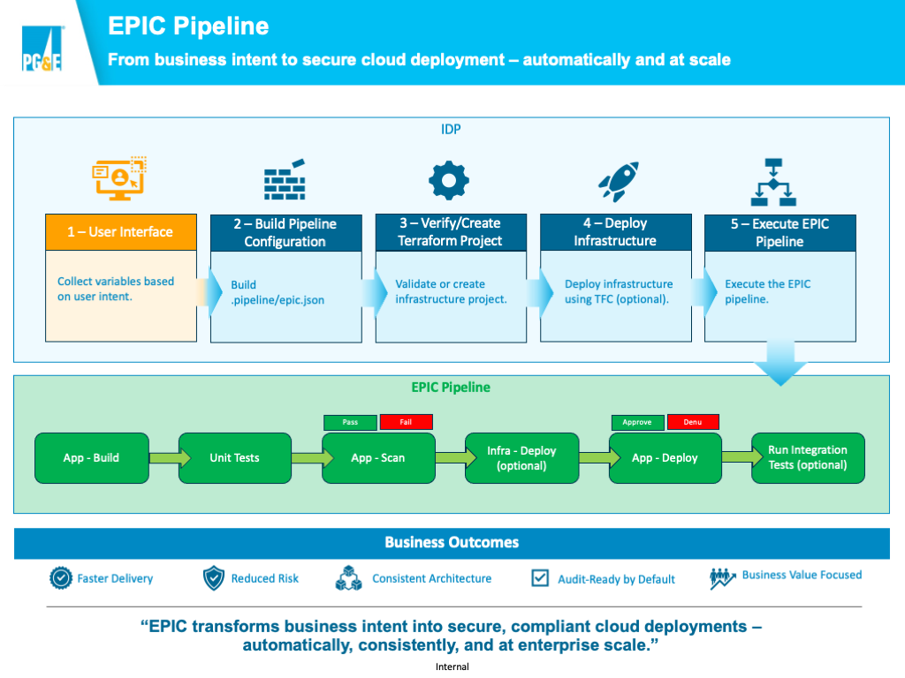

# EPIC Pipeline (Azure DevOps)

## Overview

The **EPIC Pipeline** is a modular, enterprise-grade Azure DevOps (ADO) pipeline framework designed to **build, test, scan, and deploy applications** in a cloud-agnostic and security-first manner.

It is intended to be **orchestrated by an upstream engine or IDP**, and executed consistently across projects using a **standardized pipeline contract**.

This repository focuses exclusively on **application CI/CD**.  
Infrastructure provisioning is handled upstream (via Terraform / TFC).

---



---

## High-Level Flow

1. Orchestrator triggers EPIC (via pipeline run or REST)
2. Application source is downloaded
3. Build is executed based on project type
4. Tests are executed
5. Security and quality scans are performed
6. Application is deployed
7. Optional integration tests are run

---

## Repository Structure

```
EPIC-Pipeline/
├── epic-orchestrator.yml        # Primary orchestration pipeline
├── epic-engine.yml              # Engine-facing pipeline entry
├── common/
│   └── download.yml             # Shared download logic
├── build/
│   ├── main.yml                 # Build dispatcher
│   ├── angular/
│   ├── dotnet_core/
│   ├── dotnet_framework/
│   └── python/
├── test/
│   ├── main.yml                 # Test dispatcher
│   ├── jest/
│   ├── playwright/
│   ├── pytest/
│   └── xunit/
├── scan/
│   ├── main.yml                 # Scan dispatcher
│   ├── jfrog/
│   ├── sonarqube/
│   └── wiz/
├── deploy/
│   └── main.yml                 # Deployment logic
└── .gitignore
```

---

## Design Principles

- **Modular** – Everything is a template
- **Cloud-agnostic** – No hard dependency on AWS or Azure
- **Engine-driven** – Designed for orchestration, not manual runs
- **Secure by default** – Scanning and testing are first-class citizens
- **Enterprise-ready** – Predictable, repeatable, auditable

---

## Intended Usage

This pipeline is not meant to be copied and modified per application.

Instead:
- Applications conform to the EPIC contract
- Orchestrators supply configuration
- EPIC executes consistently across teams

---

## Core Pipelines

### `epic-orchestrator.yml`

This pipeline is designed to be invoked by an **external engine** (REST or pipeline-to-pipeline).

Typical use cases:
- IDP / Wizard driven deployments
- Engine-driven pipeline orchestration
- Dynamic execution based on JSON payloads

---

### `epic-engine.yml`

This is the **primary ADO pipeline** that controls execution flow and is invoked by the EPIC Orchestrator.

Responsibilities:
- Accepts parameters from the calling system
- Determines which stages are required
- Calls modular templates (build, test, scan, deploy)
- Enforces ordering and gating

This file **does not contain business logic** — it wires stages together.

---

## Common Components

### `common/download.yml`

Shared logic used across stages to:
- Download application source
- Retrieve artifacts
- Normalize working directories

This avoids duplication and ensures consistent behavior.

---

## Build Stage

### `build/main.yml`

Acts as a **dispatcher** that selects the correct build implementation based on project type.

Supported patterns:
- Angular
- .NET (Core/Framework)
- Python
- Extensible by design

Responsibilities:
- Install tooling
- Install dependencies
- Run build
- Normalize output into a `build` folder

---

## Test Stage

### `test/main.yml`

Test execution dispatcher.

Supported scanners:
- Jest
- playwright
- pytest
- xUnit

Responsibilities:
- Execute unit tests
- Generate reports
- Fail pipeline on test failure (configurable)
- Normalize output into a `reports` folder

---

## Scan Stage

### `scan/main.yml`

Security and quality scan dispatcher.

Supported scanners:
- SonarQube
- JFrog
- Wiz

Scanner selection is **data-driven**, not hard-coded.

Responsibilities:
- Execute scanner
- Publish reports
- Enforce quality gates when configured

---

## Deploy Stage

### `deploy/main.yml`

Handles application deployment to the target runtime environment.

Design principles:
- No infrastructure creation
- No environment coupling
- Assumes infrastructure already exists

Deployment strategy is intentionally abstract to support:
- AWS
- Azure
- Hybrid environments

---

## Pipeline Contract

Each application must include a configuration file located at:

```
.pipeline/epic.json
```

This file defines how EPIC builds, tests, scans, and deploys the application.

---

## Example epic.json

```
{
  "appName": "My_App",
  "appType": "angular",
  "codePath": "/src",

  "nodeVersion": "18",

  "scanTool": "sonarqube",
  "unitTestTool": "jest",
  "integrationTestTool": "playwright",

  "awsAccountId": "123456789012",
  "awsRegion": "us-west-2"
}
```

---

## Contract Parameters

---

## Application Configuration

---

### appName (Required)

**Description**  
Logical application name used for logging, artifact naming, and deployment labeling.

**Type**  
string

**Constraints**
- Alphanumeric
- Underscores or hyphens allowed
- No spaces

---

### appType (Required)

**Description**  
Determines which build implementation EPIC executes.

**Type**  
string

**Allowed Values**

| Value              | Description                          |
|--------------------|--------------------------------------|
| angular            | Angular frontend application         |
| dotnet_core        | .NET Core / .NET 6+ application      |
| dotnet_framework   | .NET Framework application           |
| python             | Python application                   |

---

### buildType (Optional – Contextual)

**Description**  
Defines packaging behavior after build.

If omitted, EPIC performs a standard build without packaging.

**Type**  
string

### Python

| Value   | Description |
|---------|-------------|
| egg     | Build Python egg artifact |
| wheel   | Build wheel package |
| sdist   | Build source distribution |
| omitted | Validated source |

### dotnet_core / dotnet_framework

| Value   | Description |
|---------|-------------|
| package | Produce deployable package (zip / publish output) |
| ommited | Standard build |

---

### codePath (Required)

**Description**  
Relative path from repository root to the application source directory.

**Type**  
string

**Examples**
```
"."
"/"
"/src"
"/app"
```

Supports mono-repo and nested application structures.

---

## Build Runtime Versions

---

### nodeVersion (Optional)

**Default:** `"18"`

**Description**  
Node.js version used for Angular or Node-based builds.

**Type**  
string

**Examples**
```
"18"
"20"
```

---

### pythonVersion (Optional)

**Default:** `"3.11"`

**Description**  
Python runtime version used during build.

**Type**  
string

**Examples**
```
"3.10"
"3.11"
```

---

### dotnetVersion (Optional)

**Default:** `"9.x"`

**Description**  
.NET SDK version used during build.

**Type**  
string

**Examples**
```
"8.x"
"9.x"
"10.x"
```

---

## Tool Configuration

---

### scanTool (Optional)

**Description**  
Security or quality scanning tool to execute.

**Type**  
string

**Allowed Values**

| Value       | Description                          |
|-------------|--------------------------------------|
| sonarqube   | Code quality and coverage scanning   |
| jfrog       | Artifact scanning                    |
| wiz         | Cloud security scanning              |
| omitted     | Skip scanning                        |

---

### unitTestTool (Optional)

**Description**  
Unit testing framework to execute.

**Type**  
string

**Allowed Values**

| Value   | Description                     |
|---------|---------------------------------|
| jest    | JavaScript / Angular tests      |
| xunit   | .NET tests                      |
| pytest  | Python tests                    |
| omitted | Skip unit tests                 |

---

### integrationTestTool (Optional)

**Description**  
Integration or end-to-end testing framework executed after deployment.

**Type**  
string

**Allowed Values**

| Value      | Description                         |
|------------|-------------------------------------|
| playwright | Browser automation                  |
| omitted    | Skip integration tests              |

---

## AWS Deployment Parameters (Conditional)

Used only when deploying to AWS.

---

### awsAccountId

**Description**  
Target AWS account ID.

**Type**  
string

**Constraints**
- Must be a valid 12-digit AWS account ID

---

### awsRegion

**Description**  
AWS region for deployment.

**Type**  
string

**Example**
```
"us-west-2"
```

---

## Azure Deployment Parameters (Conditional)

Used only when deploying to Azure.

---

### azureSubscription

**Description**  
Azure subscription name or service connection reference used for deployment.

**Type**  
string

---

### azureResourceGroup

**Description**  
Azure resource group where the application will be deployed.

**Type**  
string

---

# Parameter Categories Summary

| Category              | Required | Notes |
|-----------------------|----------|-------|
| Application Identity  | Yes      | appName, appType, codePath |
| Packaging             | Optional | buildType |
| Runtime Versions      | Optional | nodeVersion, pythonVersion, dotnetVersion |
| Scanning              | Optional | scanTool |
| Unit Testing          | Optional | unitTestTool |
| Integration Testing   | Optional | integrationTestTool |
| AWS Deployment        | Conditional | awsAccountId, awsRegion |
| Azure Deployment      | Conditional | azureSubscription, azureResourceGroup |

---

## Validation Rules

EPIC enforces validation at runtime:

- Missing required fields fail early
- Unsupported values fail during stage dispatch
- Version fields default if omitted
- Deployment-specific parameters are validated only when deployment stage executes

---

## Contract Philosophy

The EPIC contract is:

- Declarative
- Modular
- Cloud-agnostic
- Engine-driven
- Version-controllable

Applications define intent.  
EPIC determines execution flow.

This ensures predictable enterprise behavior, strong governance, and scalable CI/CD across teams.

---

## Extending EPIC

To add support for a new build, scan, or test type:
1. Add a new folder under the appropriate stage
2. Implement the script or template
3. Register it in the stage dispatcher (`main.yml`)

No changes to the orchestrator are required.

---

## Summary

EPIC provides a **standardized CI/CD backbone** for enterprise application delivery.

It separates:
- Infrastructure provisioning
- Application lifecycle
- Orchestration logic

This keeps pipelines **clean, scalable, and governable** — exactly what you want in a regulated enterprise environment.

