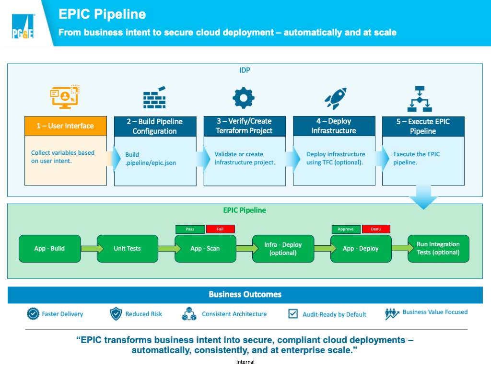

# EPIC Pipeline (Azure DevOps)

## Overview

EPIC is an enterprise-grade Azure DevOps pipeline framework for building, testing, scanning, and deploying applications — and optionally provisioning the infrastructure they run on.

It is designed to be orchestrated by an upstream engine or IDP and executed consistently across projects using a standardized pipeline contract.

Applications define their intent in a single config file. EPIC handles execution.

---



---

## High-Level Flow

1. Orchestrator validates parameters and reads the `app` section of `.pipeline/epic.json` from the application repository
2. Orchestrator invokes the EPIC Engine pipeline via Azure DevOps REST API
3. Application source is downloaded from GitHub
4. Build is executed based on project type
5. Unit tests are executed
6. Security and quality scans are performed
7. Infrastructure is provisioned if `/.infra` is present (Terraform)
8. Application is deployed to the target environment
9. Integration tests are run (optional)

Stages that need cloud/deployment configuration (infra, deploy, AMI build) read the `cloud` section of `.pipeline/epic.json` directly from the downloaded source at runtime.

---

## Repository Structure

```
EPIC-Pipeline/
├── epic-orchestrator.yml        # REST-driven entry point; reads epic.json .app section, invokes engine
├── epic-engine.yml              # Control plane; wires stages, enforces ordering and gating
├── common/
│   └── download.yml             # Clones application source from GitHub
├── infra/
│   └── main.yml                 # Terraform provisioning (init, plan, apply, destroy)
├── build/
│   ├── main.yml                 # Build dispatcher
│   ├── ami/                     # EC2 Image Builder orchestration
│   ├── angular/
│   ├── dotnet/
│   ├── dotnet_framework/
│   ├── html/
│   ├── java/
│   └── python/
├── test/
│   ├── main.yml                 # Test dispatcher
│   ├── jest/
│   ├── junit/
│   ├── playwright/
│   ├── pytest/
│   └── xunit/
├── scan/
│   ├── main.yml                 # Scan dispatcher
│   ├── jfrog/
│   ├── sonarqube/
│   └── wiz/
├── deploy/
│   ├── main.yml                 # Deployment dispatcher
│   ├── ami/                     # SSM-based AMI publish + config/test
│   ├── basic/                   # HTML/Angular → S3 + CloudFront
│   ├── dotnet/
│   ├── java/
│   └── python/
└── .gitignore
```

---

## Design Principles

- **Modular** — Every stage is a composable template
- **Declarative** — Applications define intent; EPIC determines execution
- **Cloud-agnostic** — No hard dependency on AWS or Azure
- **Engine-driven** — Designed for programmatic orchestration, not manual runs
- **Secure by default** — Scanning and testing are first-class citizens
- **Infrastructure-aware** — Can provision and manage cloud resources directly
- **Enterprise-ready** — Predictable, repeatable, auditable

---

## Intended Usage

Applications are not expected to copy or modify this pipeline. Instead:

- Applications conform to the EPIC contract (`.pipeline/epic.json`)
- Orchestrators supply configuration and trigger execution
- EPIC executes consistently across teams

---

## Core Pipelines

### `epic-orchestrator.yml`

The entry point for external systems. Typical invocations include IDP-driven deployments and REST-triggered runs.

**What it does:**
1. Validates `repo`, `branch`, and `environment` parameters
2. Shallow-clones the application repository and reads the `app` section of `.pipeline/epic.json`
3. Detects whether `/.infra` is present to determine Terraform behavior
4. Builds a deployment payload (merges `app` fields with orchestrator parameters)
5. POSTs to the Azure DevOps Pipelines REST API to trigger the EPIC Engine
6. Returns a clickable URL to the triggered pipeline run

### `epic-engine.yml`

The control plane. Accepts parameters from the orchestrator, determines which stages execute, and wires modular templates with proper dependency ordering. Contains no business logic — it is purely structural.

The engine only receives `app`-level parameters (identity, build config, tooling) and runtime parameters (repo, branch, environment, stage toggles). Cloud/deployment parameters are not passed through the engine — stages read them directly from `epic.json` at runtime.

---

## Stage Execution Order and Gating

Stages execute in dependency order. Conditional stages are skipped entirely when their corresponding tool parameter is omitted.

```
Download
├── Build             (if build=true)
├── UnitTest          (if unitTestTool is set)
├── Scan              (if scanTool is set; depends on Build and UnitTest if enabled)
├── DeployInfra       (if /.infra present; depends on Build, UnitTest, Scan if enabled)
└── Deploy            (depends on Build, UnitTest, Scan, DeployInfra if each enabled)
    └── IntegrationTest  (if integrationTestTool is set; depends on Deploy)
```

---

## Pipeline Artifacts

Each stage publishes a named artifact consumed by downstream stages:

| Artifact | Published By | Consumed By |
|----------|-------------|-------------|
| `epic-app` | Download | Build, Test, Scan, Infra, Deploy |
| `epic-build` | Build | Scan, Deploy |
| `epic-unit-tests` | Test | Scan |
| `terraform-outputs` | DeployInfra | Deploy |
| `epic-scan` | Scan (.NET only) | — |

---

## Agent Pools

| Pool | Used For |
|------|----------|
| `ubuntu-latest` | Default for all non-.NET languages and basic deployments |
| `windows-latest` | .NET Framework builds without SonarQube |
| `EPIC - Self-hosted` | .NET builds with SonarQube (requires SQ scanner pre-installed) |

---

## Prerequisites

The following secrets and variable groups must be configured in Azure DevOps:

| Secret / Variable | Variable Group | Purpose |
|-------------------|----------------|---------|
| `GITHUB_PAT` | `GV-account-access` | Clone private application repositories |
| AWS credentials | Pipeline service connection | Base credentials for STS role assumption |
| `SYSTEM_ACCESSTOKEN` | Built-in | REST API call from orchestrator to engine |

---

## Infrastructure Stage

### Overview

EPIC supports automated infrastructure provisioning via Terraform. This stage runs independently and does not block the build stage.

When a `/.infra` folder is present in the application repository, EPIC automatically runs `terraform init`, `terraform plan`, and `terraform apply`. If `/.infra` is absent, the infra stage is skipped and EPIC uses the resource values provided in the `cloud` section of `epic.json`.

Cloud credentials (`awsAccountId`, `awsRegion`) are read from the `cloud` section of `.pipeline/epic.json` at runtime.

### `/.infra` Folder Structure

EPIC expects a standard Terraform layout:

```
.infra/
├── versions.tf                 # Version declarations
├── main.tf                     # Resource definitions
├── data.tf                     # Data source declarations
├── variables.tf                # Input variable declarations
├── terraform.auto.tfvars.tf    # Input variable values
└── outputs.tf                  # Output values (used by EPIC for deployment)
```

EPIC handles backend configuration, state management, and credential injection automatically. Applications must not define backend configuration in their Terraform code.

### Backend Configuration (Automatic)

| Setting | Value |
|---------|-------|
| Bucket | `pge-epic-terraform-state` |
| Encryption | Enabled |
| Locking | Enabled |
| State key | `{awsAccountId}/{appName}-{appType}/{environment}/terraform.tfstate` |

### Credential Flow

1. EPIC base AWS credentials are loaded from the ADO service connection
2. EPIC assumes `arn:aws:iam::{awsAccountId}:role/pge-epic-deployment-role` via STS
3. Temporary credentials are injected into the Terraform environment

### Behavior

| Condition | EPIC Behavior |
|-----------|---------------|
| `/.infra` present | Runs `terraform init`, `plan`, and `apply` automatically |
| `/.infra` absent | Skips infra stage; uses resource values from `cloud` section of `epic.json` |

### Outputs

Terraform outputs defined in `outputs.tf` are captured as `output.json` and published as the `terraform-outputs` artifact. The deploy stage reads this file and resolves S3 bucket names, CloudFront distribution IDs, and EC2 instance IDs automatically — overriding any equivalent values in the `cloud` section.

---

## Build Stage

### `build/main.yml`

Dispatcher that selects the correct build implementation based on `appType`. Each implementation installs tooling, runs the build, and normalizes output into a `.build/` folder.

| Type | Build Tool | Output |
|------|-----------|--------|
| `angular` | npm | `dist/` → `.build/` |
| `ami` | EC2 Image Builder | AMI IDs → SSM → `.build/ami-manifest.json` |
| `dotnet` | dotnet CLI | Published self-contained executable or NuGet package |
| `dotnet_framework` | MSBuild | `.build/` |
| `html` | (copy) | `.build/` |
| `java` | Maven or Gradle | JAR → `.build/` |
| `python` | pip / setuptools | Syntax check, wheel, egg, or sdist |

### AMI Build

The `ami` build type triggers EC2 Image Builder pipelines, polls for completion, writes AMI IDs to SSM Parameter Store with a `LATEST` label, and produces an `ami-manifest.json` artifact. AMI-specific configuration (`components`, `imageBuilderPipelinePrefix`, `ssmParameterPrefix`) is read from the `cloud` section of `epic.json`.

---

## Test Stage

### `test/main.yml`

Executes unit or integration tests, generates reports, and fails the pipeline on test failure. Output is normalized into a `.reports/` folder and published as a pipeline artifact.

**Supported frameworks:**

| Framework | Language | Report Format |
|-----------|----------|--------------|
| `jest` | JavaScript / TypeScript | JUnit XML + LCOV coverage |
| `junit` | Java | JUnit XML |
| `pytest` | Python | JUnit XML + coverage XML |
| `xunit` | .NET | xUnit XML + OpenCover |
| `playwright` | Any | JUnit XML |

---

## Scan Stage

### `scan/main.yml`

Security and quality scan dispatcher. Scanner selection is data-driven. Enforces quality gates when configured. Consumes both build artifacts and test reports to provide full coverage analysis.

**Supported scanners:** SonarQube, JFrog, Wiz

### SonarQube Integration

- **CLI mode** (ubuntu-latest): Used for Angular, Python, Java
- **dotnet mode** (EPIC Self-hosted): Used for .NET; requires pre/post build instrumentation
- Test coverage and report paths are mapped automatically per framework
- Branch awareness is enabled via `sonar.branch.name`

---

## Deploy Stage

### `deploy/main.yml`

Handles application deployment to the target runtime environment. No infrastructure creation occurs here — the infra stage handles that. Assumes infrastructure already exists, whether provisioned by EPIC or supplied externally.

Cloud deployment parameters are read from the `cloud` section of `.pipeline/epic.json` at runtime and set as pipeline variables for the deploy sub-templates.

| Type | Target | Mechanism |
|------|--------|-----------|
| `html` / `angular` | S3 + CloudFront | `aws s3 sync`, CloudFront invalidation |
| `python` | EC2 via SSM | ZIP upload to S3, remote install + systemd restart |
| `java` | EC2 via SSM | JAR upload to S3, remote install + systemd restart |
| `dotnet` | EC2 via SSM | Executable upload to S3, remote install + systemd restart |
| `ami` | SSM Parameter Store + SSM Documents | Label SSM params, run config/test documents |

### AMI Deploy

The `ami` deploy type publishes AMIs by applying an environment label to SSM parameter versions, then optionally runs SSM configuration and test documents against pre-existing instances. AMI-specific deploy configuration (`configDocPrefix`, `testDocPrefix`, `componentDocSuffixes`, `instanceTags`) is read from the `cloud` section of `epic.json`. SSM document names are constructed as `{prefix}-{suffix}` where the suffix comes from `componentDocSuffixes` (or defaults to the component name if not mapped).

---

## Pipeline Contract

Each application must include a configuration file at:

```
.pipeline/epic.json
```

This file has two sections:

- **`app`** — Application identity, build configuration, and tooling. Read by the orchestrator and passed as engine template parameters.
- **`cloud`** — Cloud deployment targets and resource configuration. Read at runtime by infra and deploy stages directly from the downloaded source.

---

## Example `epic.json`

### Standard application (Angular)

```json
{
  "app": {
    "appName": "my-app",
    "appType": "angular",
    "codePath": "/",
    "nodeVersion": "20",
    "scanTool": "sonarqube",
    "unitTestTool": "jest"
  },
  "cloud": {
    "awsAccountId": "999999999999",
    "awsRegion": "us-west-2",
    "s3": "pge-epic-my-app-web-dev",
    "cloudfront": "X9X9X9XX99XX9X"
  }
}
```

### EC2-deployed application (Python)

```json
{
  "app": {
    "appName": "my-api",
    "appType": "python",
    "codePath": ".",
    "buildType": "wheel",
    "pythonVersion": "3.11",
    "scanTool": "sonarqube",
    "unitTestTool": "pytest"
  },
  "cloud": {
    "awsAccountId": "999999999999",
    "awsRegion": "us-west-2"
  }
}
```

### AMI application

```json
{
  "app": {
    "appName": "gis-enterprise-ami",
    "appType": "ami",
    "codePath": "/"
  },
  "cloud": {
    "awsAccountId": "999999999999",
    "awsRegion": "us-west-2",
    "components": ["webadapter", "portal", "datastore", "server"],
    "imageBuilderPipelinePrefix": "ami-factory",
    "ssmParameterPrefix": "/ami_factory",
    "configDocPrefix": "ConfigDoc",
    "testDocPrefix": "TestDoc",
    "componentDocSuffixes": {
      "webadapter": "arcgiswebadaptor",
      "portal": "arcgisportal",
      "datastore": "arcgisdatastore",
      "server": "arcgisserver"
    },
    "instanceTags": {
      "webadapter": "sor-11-5-arcgis-webadaptor-sandbox",
      "server": "sor-11-5-arcgis-hosting-sandbox",
      "datastore": "sor-11-5-arcgis-datastore-sandbox",
      "portal": "sor-11-5-arcgis-portal-sandbox"
    }
  }
}
```

If `/.infra` is present and Terraform outputs include `bucket_name`, `distribution_id`, or `instance_id`, those values override the equivalent `cloud` fields automatically.

---

## Contract Parameters

### `app` Section — Application Configuration

| Parameter | Required | Description |
|-----------|----------|-------------|
| `appName` | Yes | Logical application name. Alphanumeric, hyphens, or underscores. No spaces. |
| `appType` | Yes | Determines build and deploy implementation. See allowed values below. |
| `codePath` | Yes | Relative path from repo root to application source (e.g., `/`, `.`, `/src`). |
| `buildType` | No | Defines packaging behavior. Omit for standard build. |
| `approvalEnvironments` | No | Array of environment names that require manual approval before deploy (e.g., `["prod"]`). |

**`appType` allowed values:**

| Value | Description |
|-------|-------------|
| `ami` | AMI factory (EC2 Image Builder + SSM) |
| `angular` | Angular frontend application |
| `dotnet` | .NET Core / .NET 6+ application |
| `dotnet_framework` | .NET Framework application |
| `html` | Static HTML application |
| `java` | Java application |
| `python` | Python application |

### `app` Section — Build Runtime Versions

| Parameter | Default | Description |
|-----------|---------|-------------|
| `dotnetVersion` | `9.x` | .NET SDK version |
| `javaVersion` | `17` | Java version |
| `nodeVersion` | `18` | Node.js version |
| `pythonVersion` | `3.11` | Python version |

### `app` Section — Tool Configuration

| Parameter | Description | Allowed Values |
|-----------|-------------|----------------|
| `scanTool` | Scan tool to execute | `sonarqube`, `jfrog`, `wiz`, omit to skip |
| `unitTestTool` | Unit test framework | `jest`, `junit`, `pytest`, `xunit`, omit to skip |
| `integrationTestTool` | Integration test framework | `playwright`, omit to skip |

---

### `cloud` Section — AWS Deployment Parameters

Required when deploying to AWS and `/.infra` is absent. If `/.infra` is present, EPIC resolves resource identifiers from Terraform outputs automatically.

| Parameter | Description |
|-----------|-------------|
| `awsAccountId` | Target AWS account ID (12 digits) |
| `awsRegion` | AWS region (defaults to `us-west-2`) |
| `s3` | Target S3 bucket name (static/Angular apps) |
| `cloudfront` | CloudFront distribution ID (static/Angular apps) |
| `ec2InstanceId` | EC2 instance ID (.NET, Python, Java apps) |
| `appExecutable` | Executable name (.NET apps) |

### `cloud` Section — AMI Parameters

Required when `appType` is `ami`.

| Parameter | Description |
|-----------|-------------|
| `components` | Array of component names to build/deploy |
| `imageBuilderPipelinePrefix` | Prefix for Image Builder pipeline ARNs (default: `ami-factory`) |
| `ssmParameterPrefix` | SSM Parameter Store prefix for AMI IDs (default: `/ami_factory`) |
| `configDocPrefix` | SSM document prefix for configuration (optional, deploy only) |
| `testDocPrefix` | SSM document prefix for testing (optional, deploy only) |
| `componentDocSuffixes` | Object mapping component names to SSM document suffixes (optional — defaults to component name) |
| `instanceTags` | Object mapping component names to EC2 Name tags (optional, deploy only) |

### `cloud` Section — Azure Deployment Parameters

| Parameter | Description |
|-----------|-------------|
| `azureSubscription` | Azure subscription name or service connection reference |
| `azureResourceGroup` | Azure resource group for deployment |

---

## Parameter Categories Summary

| Category | Section | Required | Parameters |
|----------|---------|----------|------------|
| Application Identity | `app` | Yes | `appName`, `appType`, `codePath` |
| Packaging | `app` | Optional | `buildType` |
| Approval Gates | `app` | Optional | `approvalEnvironments` |
| Runtime Versions | `app` | Optional | `nodeVersion`, `pythonVersion`, `dotnetVersion`, `javaVersion` |
| Scanning | `app` | Optional | `scanTool` |
| Unit Testing | `app` | Optional | `unitTestTool` |
| Integration Testing | `app` | Optional | `integrationTestTool` |
| AWS Deployment | `cloud` | Conditional | `awsAccountId`, `awsRegion`, `s3`, `cloudfront`, `ec2InstanceId`, `appExecutable` |
| AMI Configuration | `cloud` | Conditional | `components`, `imageBuilderPipelinePrefix`, `ssmParameterPrefix`, `configDocPrefix`, `testDocPrefix`, `componentDocSuffixes`, `instanceTags` |
| Azure Deployment | `cloud` | Conditional | `azureSubscription`, `azureResourceGroup` |

---

## Validation Rules

EPIC enforces validation at runtime:

- Missing required fields fail early with a clear error
- Unsupported `appType`, `scanTool`, or `unitTestTool` values fail during stage dispatch
- Runtime version fields default to known-good values if omitted
- Deployment parameters are validated only when the deploy stage executes
- If `/.infra` is present, Terraform outputs are validated before the deploy stage runs

---

## Extending EPIC

To add support for a new build type, test framework, or scanner:

1. Create a new folder under the appropriate stage directory
2. Implement the YAML template following the existing conventions
3. Register it in the stage dispatcher (`main.yml`) using the `${{ if eq(...) }}` pattern

No changes to `epic-orchestrator.yml` or `epic-engine.yml` are required.

---

## Summary

EPIC provides a standardized CI/CD backbone for enterprise application delivery.

It separates:

- **Application configuration** (`app` section — identity, tooling, build intent)
- **Cloud deployment** (`cloud` section — targets, credentials, resources)
- **Infrastructure provisioning** (`/.infra` + Terraform)
- **Orchestration logic** (engine + orchestrator)

This keeps pipelines clean, scalable, and governable across teams.
