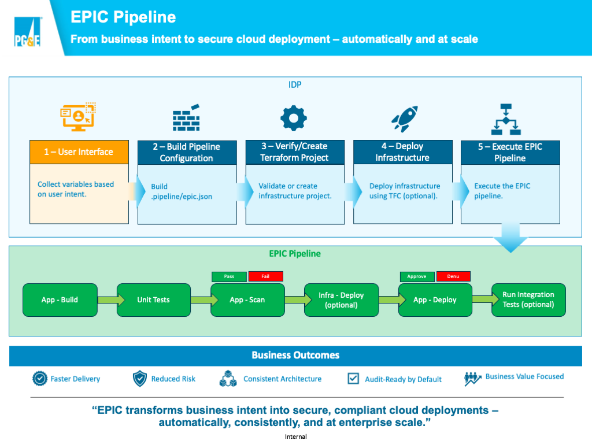

# EPIC (Enterprise Pipeline for Infrastructure and Cloud) ADO Pipeline

## Overview

EPIC is an enterprise-grade Azure DevOps pipeline framework for building, testing, scanning, and deploying applications — and optionally provisioning the infrastructure they run on.

It is designed to be orchestrated by an upstream engine or IDP and executed consistently across projects using a standardized pipeline contract.

Applications define their intent in a single config file. EPIC handles execution.

---



---

## High-Level Flow

1. Orchestrator validates parameters and reads the `app` section of `.pipeline/epic.json` from the application repository
2. Orchestrator invokes the EPIC Engine pipeline via Azure DevOps REST API
3. Application source is downloaded from GitHub
4. Build is executed based on project type
5. Build tests are executed
6. Security and quality scans are performed
7. Infrastructure is provisioned if `/.infra` is present (Terraform)
8. Application is deployed to the target environment (AWS or Azure)
9. Integration tests are run (optional)

Stages that need cloud/deployment configuration (infra, deploy, AMI build) read the `cloud` section of `.pipeline/epic.json` directly from the downloaded source at runtime.

---

## Repository Structure

```
EPIC-Pipeline/
├── epic-orchestrator.yml        # REST-driven entry point; reads epic.json .app section, invokes engine
├── epic-engine.yml              # Control plane; wires stages, enforces ordering and gating
├── common/
│   ├── download.yml             # Clones application source from GitHub
│   └── jfrog/
│       ├── upload.yml           # Uploads build artifacts to JFrog Artifactory
│       └── download.yml         # Downloads artifacts from JFrog Artifactory
├── infra/
│   ├── main.yml                 # Infrastructure dispatcher (routes by cloud provider)
│   ├── aws.yml                  # AWS Terraform provisioning (S3 backend, STS role assumption)
│   ├── azure.yml                # Azure Terraform provisioning (Storage Account backend)
│   └── btp.yml                  # SAP BTP Terraform provisioning (Secrets Manager + BTP/CF providers)
├── build/
│   ├── main.yml                 # Build dispatcher
│   ├── ami/                     # EC2 Image Builder orchestration
│   ├── angular/
│   ├── react/
│   ├── dotnet/
│   ├── dotnet_framework/
│   ├── java/
│   ├── php/
│   └── python/
├── test/
│   ├── main.yml                 # Test dispatcher (build + integration)
│   ├── jest/
│   ├── vitest/
│   ├── junit/
│   ├── phpunit/
│   ├── pytest/
│   ├── xunit/
│   └── playwright/              # Integration tests (browser E2E against deployed app)
├── scan/
│   ├── main.yml                 # Scan dispatcher
│   ├── sonarqube/
│   │   ├── prepare.yml          # SonarQube prepare (sets properties per framework)
│   │   ├── normalize.yml        # Normalizes coverage paths for multi-agent builds
│   │   └── scan.yml             # SonarQube analyze + quality gate
│   └── wiz/
│       └── main.yml             # Wiz CLI dir scan (IaC, secrets, vulnerabilities)
├── deploy/
│   ├── main.yml                 # Deployment dispatcher (cloud-aware)
│   ├── aws/
│   │   ├── static/              # HTML/Angular/React → S3 + CloudFront
│   │   ├── ec2/                 # dotnet, python, java → S3 + EC2 via SSM
│   │   └── ami/                 # SSM-based AMI publish + config/test
│   └── azure/
│       └── app-service/         # App Service zip deploy (any runtime)
└── .gitignore
```

---

## Design Principles

- **Modular** — Every stage is a composable template
- **Declarative** — Applications define intent; EPIC determines execution
- **Cloud-aware** — Supports both AWS and Azure deployments from the same pipeline
- **Engine-driven** — Designed for programmatic orchestration, not manual runs
- **Secure by default** — Scanning and testing are first-class citizens
- **Infrastructure-aware** — Can provision and manage cloud resources directly
- **Enterprise-ready** — Predictable, repeatable, auditable

---

## Intended Usage

Applications are not expected to copy or modify this pipeline. Instead:

- Applications conform to the EPIC contract (`.pipeline/epic.json`)
- Orchestrators supply configuration and trigger execution
- EPIC executes consistently across teams

---

## Core Pipelines

### `epic-orchestrator.yml`

The entry point for external systems. Typical invocations include IDP-driven deployments and REST-triggered runs.

**What it does:**
1. Validates `repo`, `branch`, `config`, and `environment` parameters
2. Shallow-clones the application repository and reads the `app` section of the specified epic.json config
3. Detects cloud provider from `epic.json` (`awsAccountId` → AWS, `azureSubscriptionId` → Azure, `appType: "btp"` → BTP)
4. Resolves `infraPath` (defaults to `.infra`) and checks whether infrastructure exists
5. Resolves `requireApproval` from `approvalEnvironments` array if the target environment is listed
6. Tags its own build with `epicRepo.{repo}` and `epicAppName.{appName}`
7. Builds a deployment payload (merges `app` fields with orchestrator parameters including `cloudProvider` and `terraformAction`)
8. POSTs to the Azure DevOps Pipelines REST API to trigger the EPIC Engine
9. Returns a clickable URL to the triggered pipeline run

### `epic-engine.yml`

The control plane. Accepts parameters from the orchestrator, determines which stages execute, and wires modular templates with proper dependency ordering. Contains no business logic — it is purely structural.

The engine receives `app`-level parameters (identity, build config, tooling) and runtime parameters (`repo`, `branch`, `environment`, `cloudProvider`, `terraformAction`, `requireApproval`, stage toggles). Cloud/deployment parameters are not passed through the engine — stages read them directly from `epic.json` at runtime.

The engine also defines `defaultRuntimeVersion` as a compile-time variable based on `appType`, used by build and test templates when `runtimeVersion` is not provided in `epic.json`.

**Build Tags:** During the Download stage, the engine tags its build with metadata for traceability and IDP integration:
- `epicRepo.{repo}` — source repository
- `epicAppName.{appName}` — logical application name
- `epicAppType.{appType}` — application type
- `epicEnvironment.{environment}` — target environment
- `epicCloud.{cloudProvider}` — cloud provider (aws, azure, btp)

---

## Stage Execution Order and Gating

Stages execute in dependency order. Conditional stages are skipped entirely when their corresponding tool parameter is omitted.

```
Download
├── Build             (if build=true)
├── BuildTest         (if buildTestTool is set)
├── Scan              (if scanTool is set; depends on Build and BuildTest if enabled)
├── DeployInfra       (if terraformAction != none; depends on Build, BuildTest, Scan if enabled)
├── Approval          (if requireApproval=true; depends on Build, BuildTest, Scan, DeployInfra)
└── Deploy            (depends on Build, BuildTest, Scan, DeployInfra, Approval if each enabled)
    └── IntegrationTest  (if integrationTestTool is set; depends on Deploy)
```

---

## Pipeline Artifacts

Each stage publishes a named artifact consumed by downstream stages:

| Artifact | Published By | Consumed By |
|----------|-------------|-------------|
| `epic-app` | Download | Build, Test, Scan, Infra, Deploy |
| `epic-build` | Build | Scan, Deploy |
| `epic-build-tests` | BuildTest | Scan |
| `epic-integration-tests` | IntegrationTest | — |
| `terraform-outputs` | DeployInfra | Deploy, IntegrationTest (resolves `BASE_URL`) |
| `epic-scan` | Scan (.NET only) | — |
| `epic-wiz-scan` | Scan (Wiz only) | — |

---

## Agent Pools

| Pool | Used For |
|------|----------|
| `ubuntu-latest` | Default for all non-.NET languages and basic deployments |
| `windows-latest` | .NET Framework builds without SonarQube |
| `EPIC - Self-hosted` | .NET builds with SonarQube, Wiz scans (requires SQ scanner and Wiz CLI pre-installed) |

---

## Prerequisites

The following secrets and variable groups must be configured in Azure DevOps:

| Secret / Variable | Variable Group | Purpose |
|-------------------|----------------|---------|
| `GITHUB_PAT` | `GV-account-access` | Clone private application repositories |
| `WIZ_CLIENT_ID` | `GV-account-access` | Wiz service account client ID |
| `WIZ_CLIENT_SECRET` | `GV-account-access` | Wiz service account client secret |
| AWS credentials | `AWS` service connection | Base credentials for STS role assumption |
| Azure credentials | `Azure` service connection | Azure App Service deployments |
| `SYSTEM_ACCESSTOKEN` | Built-in | REST API call from orchestrator to engine |

---

## Infrastructure Stage

### Overview

EPIC supports automated infrastructure provisioning via Terraform. This stage runs independently and does not block the build stage.

The infra stage executes when `terraformAction` is not `none`. The orchestrator determines this based on the presence of an infrastructure folder (resolved from `app.infraPath`, defaulting to `.infra`) and the user's requested action (`apply` or `destroy`). If no infrastructure folder exists or the action is `none`, the infra stage is skipped and EPIC uses the resource values provided in the `cloud` section of `epic.json`.

Cloud credentials are read from the `cloud` section of `.pipeline/epic.json` at runtime.

### `/.infra` Folder Structure

EPIC expects a standard Terraform layout:

```
.infra/
├── terraform.tf                # Backend + provider config
├── main.tf                     # Resource definitions
├── data.tf                     # Data source declarations
├── variables.tf                # Input variable declarations
├── terraform.auto.tfvars       # Input variable values
└── outputs.tf                  # Output values (used by EPIC for deployment)
```

### Backend Configuration

**AWS applications:**

| Setting | Value |
|---------|-------|
| Backend | S3 (`pge-epic-tfstate`) |
| Encryption | Server-side (SSE-S3, `encrypt=true`) |
| Locking | S3 native lock file (`use_lockfile=true`) |
| State key | `{awsAccountId}/{appName}-{appType}/{environment}/terraform.tfstate` |

**Azure applications:**

| Setting | Value |
|---------|-------|
| Backend | Azure Storage (`pgeepicterraformstate`) |
| Container | `tfstate` |
| Encryption | Storage account encryption |
| State key | `{azureSubscriptionId}/{appName}-{appType}/{environment}/terraform.tfstate` |

### Credential Flow

**AWS:**
1. EPIC base AWS credentials are loaded from the ADO service connection
2. EPIC assumes `arn:aws:iam::{awsAccountId}:role/pge-epic-deployment-role` via STS
3. Temporary credentials are injected into the Terraform environment

**Azure:**
1. EPIC Azure credentials are loaded from the ADO `Azure` service connection
2. Service Principal authenticates directly to the target subscription

### Behavior

| Condition | EPIC Behavior |
|-----------|---------------|
| `terraformAction = apply` | Runs `terraform init`, `plan`, and `apply` |
| `terraformAction = destroy` | Runs `terraform init`, `plan -destroy`, and `apply` |
| `terraformAction = none` | Skips infra stage; uses resource values from `cloud` section of `epic.json` |

### Outputs

Terraform outputs defined in `outputs.tf` are captured as `output.json` and published as the `terraform-outputs` artifact. The deploy stage reads this file and resolves deployment targets automatically — overriding any equivalent values in the `cloud` section.

**Conventional outputs consumed by EPIC:**

| Output | Consumed By | Purpose |
|--------|-------------|---------|
| `bucket_name` | Deploy (AWS static) | Target S3 bucket |
| `distribution_id` | Deploy (AWS static) | CloudFront distribution for cache invalidation |
| `instance_id` | Deploy (AWS EC2) | Target EC2 instance for SSM deploy |
| `app_service_name`, `resource_group_name` | Deploy (Azure App Service) | Target App Service |
| `app_url` | IntegrationTest | Deployed application URL — used as `BASE_URL` for integration tests |

---

## Build Stage

### `build/main.yml`

Dispatcher that selects the correct build implementation based on `appType`. Each implementation installs tooling, runs the build, and normalizes output into a `.build/` folder.

Runtime versions are resolved via `coalesce(parameters.runtimeVersion, variables.defaultRuntimeVersion)` — the app can override in `epic.json`, otherwise the engine's default per appType is used.

| Type | Build Tool | Output |
|------|-----------|--------|
| `angular` | npm | `dist/` → `.build/` |
| `react` | npm | `build/` / `dist/` / `out/` → `.build/` |
| `ami` | EC2 Image Builder | AMI IDs → SSM → `.build/ami-manifest.json` |
| `dotnet` | dotnet CLI | Published self-contained executable or NuGet package |
| `dotnet_framework` | MSBuild | `.build/` |
| `html` | (copy) | `.build/` |
| `java` | Maven or Gradle | JAR → `.build/` |
| `php` | Composer | `.build/` (excludes tests, .infra, .pipeline) |
| `python` | pip / setuptools | Syntax check, wheel, egg, or sdist |

### Runtime Version Defaults

If `runtimeVersion` is not specified in `epic.json`, the engine uses these defaults (defined in `epic-engine.yml` as `defaultRuntimeVersion`):

| appType | Default |
|---------|---------|
| `angular`, `react`, `html` | `18` (Node.js) |
| `dotnet`, `dotnet_framework` | `9.x` (.NET SDK) |
| `python` | `3.11` |
| `java` | `17` |
| `php` | `8.3` |

### AMI Build

The `ami` build type triggers EC2 Image Builder pipelines, polls for completion, writes AMI IDs to SSM Parameter Store with a `LATEST` label, and produces an `ami-manifest.json` artifact. AMI-specific configuration (`components`, `imageBuilderPipelinePrefix`, `ssmParameterPrefix`) is read from the `cloud` section of `epic.json`.

---

## Test Stage

### `test/main.yml`

Executes unit or integration tests, generates reports, and fails the pipeline on test failure. Output is normalized into a `.reports/` folder and published as a pipeline artifact.

**Build test frameworks (`buildTestTool`):**

| Framework | Language | Report Format |
|-----------|----------|--------------|
| `jest` | JavaScript / TypeScript | JUnit XML + LCOV coverage |
| `vitest` | JavaScript / TypeScript | LCOV coverage |
| `junit` | Java | JUnit XML + JaCoCo coverage |
| `phpunit` | PHP | JUnit XML + Clover coverage |
| `pytest` | Python | JUnit XML + coverage XML |
| `xunit` | .NET | xUnit XML + OpenCover |

**Integration test frameworks (`integrationTestTool`):**

| Framework | Use Case | Report Format |
|-----------|----------|--------------|
| `playwright` | Browser-based end-to-end tests against the deployed app | JUnit XML + HTML report (+ traces/screenshots on failure) |

### Integration Tests

The `IntegrationTest` stage runs after `Deploy` (and `DeployInfra`, if present) and is gated by `integrationTestTool` being set. Tests run against the freshly-deployed application.

**`BASE_URL` resolution:** Before the integration test template runs, `test/main.yml` resolves a `BASE_URL` pipeline variable that points at the deployed app. Tests consume it via `process.env.BASE_URL` (or the equivalent in their framework).

Resolution order:

1. **Terraform output `app_url`** — if `terraform-outputs` artifact is published by the DeployInfra stage and contains an `app_url` output, that value is used.
2. **`cloud.appUrl` from `epic.json`** — fallback for apps deploying to pre-existing infrastructure (no `.infra` folder).

If neither is present, the integration test stage fails with a clear error.

#### Playwright

The `playwright` template:

1. Installs Node and runs `npm install --legacy-peer-deps`
2. Runs `npx playwright install --with-deps` to install browsers + system libraries on the agent
3. Runs `npx playwright test --reporter=list,junit,html` with `BASE_URL` exported as an env var
4. Copies `reports/` → `.reports/` for artifact publication
5. Publishes JUnit results to the ADO Tests tab via `PublishTestResults@2`

**App-side requirements:**

- `npm install -D @playwright/test`
- `playwright.config.ts` must:
  - Set `use.baseURL: process.env.BASE_URL` so tests target the deployed app
  - Emit JUnit reports to `reports/junit/` (e.g. `outputFile: 'reports/junit/results.xml'`)
  - Emit HTML reports to `reports/html/` (e.g. `outputFolder: 'reports/html'`)
- Set `integrationTestTool: "playwright"` in `.pipeline/epic.json`
- Expose the deployed app URL via **one** of:
  - A Terraform output named `app_url` in `.infra/outputs.tf` (preferred when EPIC provisions infra), e.g.:
    ```hcl
    output "app_url" {
      value = "https://${aws_cloudfront_distribution.this.domain_name}"
    }
    ```
  - A `cloud.appUrl` field in `epic.json` (when deploying to pre-existing infrastructure)

**Network access:** Microsoft-hosted `ubuntu-latest` agents must be able to reach `BASE_URL`. Apps deployed behind private networking, internal ALBs, or `*.lab.pge.com` URLs will require a self-hosted agent in the same network.

---

## Scan Stage

### `scan/main.yml`

Security and quality scan dispatcher. Scanner selection is data-driven. Enforces quality gates when configured. Consumes both build artifacts and test reports to provide full coverage analysis.

**Supported scanners:** SonarQube, Wiz

### SonarQube Integration

- Runs on `EPIC - Self-hosted` pool (in-house agent with SonarQube CLI available)
- **CLI mode** (ubuntu-latest): Used for Angular, React, Python, Java, PHP
- **dotnet mode** (EPIC Self-hosted): Used for .NET; requires pre/post build instrumentation
- Test coverage and report paths are mapped automatically per framework
- Branch awareness is enabled via `sonar.branch.name`

### Wiz Integration

- Runs on `EPIC - Self-hosted` pool (in-house agent with Wiz CLI available)
- Authenticates via `WIZ_CLIENT_ID` and `WIZ_CLIENT_SECRET` from the `GV-account-access` variable group
- Performs a directory scan (IaC, secrets, and vulnerability detection)
- Policy is configured per-app via `scanPolicy` in `epic.json`
- Results are published as the `epic-wiz-scan` artifact in SARIF format

---

## Deploy Stage

### `deploy/main.yml`

Cloud-aware deployment dispatcher. Detects the cloud provider from `epic.json` and routes to the appropriate deploy implementation.

**Cloud detection:** The dispatcher reads `epic.json` and checks for `cloud.azureSubscriptionId` (Azure) or `cloud.awsAccountId` (AWS). Based on the result, it reads cloud-specific config and routes accordingly.

**Resolution order for deploy targets:**
1. Terraform outputs (from DeployInfra stage)
2. Cloud config from `epic.json` (fallback for pre-existing infrastructure)

### Deploy Structure

```
deploy/
├── main.yml              ← Detects cloud, reads config, routes
├── aws/
│   ├── static/           ← S3 + CloudFront (html, angular)
│   ├── ec2/              ← S3 + EC2 via SSM (dotnet, python, java)
│   └── ami/              ← Image Builder + SSM config/test
└── azure/
    └── app-service/      ← az webapp deploy (any runtime)
```

### AWS Deploy Targets

| appType | Target | Mechanism |
|---------|--------|-----------|
| `html`, `angular`, `react` | S3 + CloudFront | `aws s3 sync`, CloudFront invalidation |
| `dotnet` | EC2 via SSM | ZIP upload to S3, remote install + systemd restart |
| `python` | EC2 via SSM | ZIP upload to S3, remote install + venv + systemd restart |
| `java` | EC2 via SSM | JAR upload to S3, remote install + systemd restart |
| `ami` | SSM Parameter Store + SSM Documents | Label SSM params, run config/test documents |

### Azure Deploy Targets

| appType | Target | Mechanism |
|---------|--------|-----------|
| Any (`php`, `dotnet`, `python`, `java`, `node`) | App Service | `az webapp deploy --type zip` |

Azure App Service handles runtime selection at the infrastructure level — the deploy template is runtime-agnostic.

### AMI Deploy

The `ami` deploy type publishes AMIs by applying an environment label to SSM parameter versions, then optionally runs SSM configuration and test documents against pre-existing instances. AMI-specific deploy configuration (`configDocPrefix`, `testDocPrefix`, `componentDocSuffixes`, `instanceTags`) is read from the `cloud` section of `epic.json`. SSM document names are constructed as `{prefix}-{suffix}` where the suffix comes from `componentDocSuffixes` (or defaults to the component name if not mapped).

### BTP (SAP Business Technology Platform)

BTP applications (`appType: "btp"`) do not use the Build or Deploy App stages — infrastructure provisioning via Terraform **is** the deployment. The entire lifecycle is handled by the `infra/btp.yml` template through the DeployInfra stage.

**Flow:**
1. Reads `cloud.secretsManager.name` and `cloud.secretsManager.keys` from `epic.json`
2. Assumes the EPIC deployment role in the target AWS account (secrets are stored in AWS Secrets Manager)
3. Retrieves BTP/CF credentials from Secrets Manager and writes them to a temporary env file
4. Runs Terraform init (S3 backend), fmt, and validate
5. If scan is enabled and action is apply: runs TFLint
6. If tests are enabled and action is apply: runs `terraform test`
7. If `terraformAction = apply`: runs `terraform plan` and `terraform apply`
8. If `terraformAction = destroy`: runs `terraform plan -destroy` and `terraform apply`

**Disabled stages:** Build App, Deploy App, and Integration Tests are not applicable for BTP and should be disabled when triggering runs.

**Required `cloud` parameters for BTP:**

| Parameter | Description |
|-----------|-------------|
| `awsAccountId` | AWS account where BTP secrets are stored |
| `awsRegion` | AWS region for Secrets Manager (defaults to `us-west-2`) |
| `secretsManager.name` | Name of the AWS Secrets Manager secret |
| `secretsManager.keys` | Array of secret keys to retrieve (e.g., `BTP_USERNAME`, `BTP_PASSWORD`, `CF_USER`, `CF_PASSWORD`) |

---

## Pipeline Contract

Each application must include a configuration file at:

```
.pipeline/epic.json
```

This file has two sections:

- **`app`** — Application identity, build configuration, and tooling. Read by the orchestrator and passed as engine template parameters.
- **`cloud`** — Cloud deployment targets and resource configuration. Read at runtime by infra and deploy stages directly from the downloaded source.

---

## Example `epic.json`

### AWS — Angular (S3 + CloudFront)

```json
{
  "app": {
    "appName": "my-app",
    "appType": "angular",
    "codePath": "/",
    "runtimeVersion": "20",
    "scanTool": "sonarqube",
    "buildTestTool": "jest"
  },
  "cloud": {
    "awsAccountId": "999999999999",
    "awsRegion": "us-west-2",
    "s3": "pge-epic-my-app-web-dev",
    "cloudfront": "X9X9X9XX99XX9X"
  }
}
```

### AWS — React (S3 + CloudFront)

```json
{
  "app": {
    "appName": "my-react-app",
    "appType": "react",
    "codePath": "/",
    "runtimeVersion": "20",
    "scanTool": "sonarqube",
    "buildTestTool": "jest"
  },
  "cloud": {
    "awsAccountId": "999999999999",
    "awsRegion": "us-west-2",
    "s3": "pge-epic-my-react-app-web-dev",
    "cloudfront": "X9X9X9XX99XX9X"
  }
}
```

### AWS — React with Playwright Integration Tests

This example uses pre-existing infrastructure (no `.infra/` folder), so the deployed URL is provided via `cloud.appUrl`. When `.infra/` is present, prefer exposing it as a Terraform output named `app_url` instead.

```json
{
  "app": {
    "appName": "my-react-app",
    "appType": "react",
    "codePath": "/",
    "runtimeVersion": "20",
    "scanTool": "sonarqube",
    "buildTestTool": "vitest",
    "integrationTestTool": "playwright"
  },
  "cloud": {
    "awsAccountId": "999999999999",
    "awsRegion": "us-west-2",
    "s3": "pge-epic-my-react-app-web-dev",
    "cloudfront": "X9X9X9XX99XX9X",
    "appUrl": "https://my-react-app-dev.example.com"
  }
}
```

### AWS — Python (EC2 via SSM)

```json
{
  "app": {
    "appName": "my-api",
    "appType": "python",
    "codePath": ".",
    "buildType": "wheel",
    "runtimeVersion": "3.11",
    "scanTool": "sonarqube",
    "buildTestTool": "pytest"
  },
  "cloud": {
    "awsAccountId": "999999999999",
    "awsRegion": "us-west-2"
  }
}
```

### AWS — AMI (Image Builder)

```json
{
  "app": {
    "appName": "gis-enterprise-ami",
    "appType": "ami",
    "codePath": "/"
  },
  "cloud": {
    "awsAccountId": "999999999999",
    "awsRegion": "us-west-2",
    "components": ["webadapter", "portal", "datastore", "server"],
    "imageBuilderPipelinePrefix": "ami-factory",
    "ssmParameterPrefix": "/ami_factory",
    "configDocPrefix": "ConfigDoc",
    "testDocPrefix": "TestDoc",
    "componentDocSuffixes": {
      "webadapter": "arcgiswebadaptor",
      "portal": "arcgisportal",
      "datastore": "arcgisdatastore",
      "server": "arcgisserver"
    },
    "instanceTags": {
      "webadapter": "sor-11-5-arcgis-webadaptor-sandbox",
      "server": "sor-11-5-arcgis-hosting-sandbox",
      "datastore": "sor-11-5-arcgis-datastore-sandbox",
      "portal": "sor-11-5-arcgis-portal-sandbox"
    }
  }
}
```

### Azure — PHP (App Service)

```json
{
  "app": {
    "appName": "my-php-app",
    "appType": "php",
    "codePath": "/",
    "runtimeVersion": "8.3"
  },
  "cloud": {
    "azureSubscriptionId": "xxxxxxxx-xxxx-xxxx-xxxx-xxxxxxxxxxxx",
    "azureRegion": "westus2",
    "resourceGroupName": "rg-my-app-dev",
    "appServiceName": "my-app-dev"
  }
}
```

### BTP — SAP BTP (Terraform)

```json
{
  "app": {
    "appName": "my-btp-environment",
    "appType": "btp",
    "infraPath": "/my-btp-environment",
    "configPath": "/my-btp-environment/.pipeline"
  },
  "cloud": {
    "awsAccountId": "999999999999",
    "awsRegion": "us-west-2",
    "secretsManager": {
      "name": "my-secrets-manager-name",
      "keys": ["BTP_USERNAME", "BTP_PASSWORD", "CF_USER", "CF_PASSWORD"]
    }
  }
}
```

### AWS — Angular with Wiz Scanning

```json
{
  "app": {
    "appName": "my-secure-app",
    "appType": "angular",
    "codePath": "/",
    "runtimeVersion": "20",
    "scanTool": "wiz",
    "scanPolicy": "Default IaC policy",
    "buildTestTool": "jest"
  },
  "cloud": {
    "awsAccountId": "999999999999",
    "awsRegion": "us-west-2",
    "s3": "pge-epic-my-secure-app-web-dev",
    "cloudfront": "X9X9X9XX99XX9X"
  }
}
```

If `/.infra` is present and Terraform outputs include deployment targets (e.g., `bucket_name`, `distribution_id`, `instance_id`, `app_service_name`, `resource_group_name`), those values override the equivalent `cloud` fields automatically.

---

## Contract Parameters

### `app` Section — Application Configuration

| Parameter | Required | Description |
|-----------|----------|-------------|
| `appName` | Yes | Logical application name. Alphanumeric, hyphens, or underscores. No spaces. |
| `appType` | Yes | Determines build and deploy implementation. See allowed values below. |
| `codePath` | Yes | Relative path from repo root to application source (e.g., `/`, `.`, `/src`). |
| `infraPath` | No | Relative path to infrastructure directory (defaults to `.infra`). |
| `buildType` | No | Defines packaging behavior. Omit for standard build. |
| `runtimeVersion` | No | Runtime version override (e.g., `"20"` for Node, `"10.x"` for .NET). If omitted, engine default is used. |
| `approvalEnvironments` | No | Array of environment names that require manual approval before deploy (e.g., `["prod"]`). |

**`appType` allowed values:**

| Value | Cloud | Description |
|-------|-------|-------------|
| `ami` | AWS | AMI factory (EC2 Image Builder + SSM) |
| `angular` | AWS | Angular frontend application |
| `react` | AWS | React frontend application (CRA, Vite, Next.js static) |
| `dotnet` | AWS | .NET Core / .NET 6+ application |
| `dotnet_framework` | AWS | .NET Framework application |
| `html` | AWS | Static HTML application |
| `java` | AWS | Java application |
| `php` | Azure | PHP application |
| `python` | AWS | Python application |
| `btp` | BTP | SAP BTP Terraform provisioning |
| `infra` | AWS | Infrastructure-only Terraform provisioning (no app build/deploy — runs DeployInfra stage only; disable Build and Deploy toggles) |

### `app` Section — Tool Configuration

| Parameter | Description | Allowed Values |
|-----------|-------------|----------------|
| `scanTool` | Scan tool to execute | `sonarqube`, `wiz`, omit to skip |
| `scanPolicy` | Wiz policy name to evaluate against | Any valid Wiz policy name (required when `scanTool` is `wiz`) |
| `buildTestTool` | Build test framework | `jest`, `vitest`, `junit`, `phpunit`, `pytest`, `xunit`, omit to skip |
| `integrationTestTool` | Integration test framework | `playwright`, omit to skip |

---

### `cloud` Section — AWS Deployment Parameters

#### Required

These parameters are always required for AWS deployments. They are used for authentication (STS role assumption) and backend configuration — they cannot be derived from Terraform outputs.

| Parameter | Description |
|-----------|-------------|
| `awsAccountId` | Target AWS account ID (12 digits) |
| `awsRegion` | AWS region (defaults to `us-west-2`) |

#### Required if `.infra/` is not present (by `appType`)

These parameters identify pre-existing infrastructure resources. If `/.infra` is present, EPIC resolves them from Terraform outputs automatically and these can be omitted.

| `appType` | Required Parameters |
|-----------|---------------------|
| `html`, `angular`, `react` | `s3`, `cloudfront` |
| `dotnet` | `s3`, `ec2InstanceId`, `appExecutable` |
| `java` | `s3`, `ec2InstanceId` |
| `python` | `s3`, `ec2InstanceId`, (optional) `appExecutable` |

| Parameter | Description |
|-----------|-------------|
| `s3` | Target S3 bucket name (used for static hosting or deployment artifact staging) |
| `cloudfront` | CloudFront distribution ID for cache invalidation |
| `ec2InstanceId` | EC2 instance ID targeted via SSM for deployment |
| `appExecutable` | Name of the executable to launch after deploy |
| `appUrl` | Deployed application URL. Used by integration tests as `BASE_URL` when no Terraform `app_url` output is available. Required when `integrationTestTool` is set and `.infra/` is absent. |

#### Required when `appType` is `ami`.

| Parameter | Description |
|-----------|-------------|
| `components` | Array of component names to build/deploy |
| `imageBuilderPipelinePrefix` | Prefix for Image Builder pipeline ARNs (default: `ami-factory`) |
| `ssmParameterPrefix` | SSM Parameter Store prefix for AMI IDs (default: `/ami_factory`) |
| `configDocPrefix` | SSM document prefix for configuration (optional, deploy only) |
| `testDocPrefix` | SSM document prefix for testing (optional, deploy only) |
| `componentDocSuffixes` | Object mapping component names to SSM document suffixes (optional — defaults to component name) |
| `instanceTags` | Object mapping component names to EC2 Name tags (optional, deploy only) |

### `cloud` Section — Azure Deployment Parameters

Required when deploying to Azure and `/.infra` is absent. If `/.infra` is present, EPIC resolves resource identifiers from Terraform outputs automatically.

| Parameter | Description |
|-----------|-------------|
| `azureSubscriptionId` | Target Azure subscription ID |
| `azureRegion` | Azure region (defaults to `westus2`) |
| `resourceGroupName` | Target resource group name |
| `appServiceName` | Target App Service name |
| `appUrl` | Deployed application URL. Used by integration tests as `BASE_URL` when no Terraform `app_url` output is available. Required when `integrationTestTool` is set and `.infra/` is absent. |

### `cloud` Section — SAP BTP Parameters

Required when `appType` is `btp`. BTP credentials are stored in AWS Secrets Manager and retrieved at runtime by the infrastructure stage.

| Parameter | Required | Description |
|-----------|----------|-------------|
| `awsAccountId` | Yes | AWS account ID where BTP secrets are stored |
| `awsRegion` | No | AWS region for Secrets Manager (defaults to `us-west-2`) |
| `secretsManager.name` | Yes | Name of the AWS Secrets Manager secret containing BTP/CF credentials |
| `secretsManager.keys` | Yes | Array of keys to retrieve from the secret (e.g., `["BTP_USERNAME", "BTP_PASSWORD", "CF_USER", "CF_PASSWORD"]`) |

---

## Parameter Categories Summary

| Category | Section | Required | Parameters |
|----------|---------|----------|------------|
| Application Identity | `app` | Yes | `appName`, `appType`, `codePath` |
| Infrastructure | `app` | Optional | `infraPath` |
| Packaging | `app` | Optional | `buildType` |
| Runtime Version | `app` | Optional | `runtimeVersion` |
| Approval Gates | `app` | Optional | `approvalEnvironments` |
| Scanning | `app` | Optional | `scanTool`, `scanPolicy` |
| Build Testing | `app` | Optional | `buildTestTool` |
| Integration Testing | `app` | Optional | `integrationTestTool` |
| AWS Deployment | `cloud` | Conditional | `awsAccountId`, `awsRegion`, `s3`, `cloudfront`, `ec2InstanceId`, `appExecutable`, `appUrl` |
| AMI Configuration | `cloud` | Conditional | `components`, `imageBuilderPipelinePrefix`, `ssmParameterPrefix`, `configDocPrefix`, `testDocPrefix`, `componentDocSuffixes`, `instanceTags` |
| Azure Deployment | `cloud` | Conditional | `azureSubscriptionId`, `azureRegion`, `resourceGroupName`, `appServiceName`, `appUrl` |
| SAP BTP | `cloud` | Conditional | `awsAccountId`, `awsRegion`, `secretsManager.name`, `secretsManager.keys` |

---

## Validation Rules

EPIC enforces validation at runtime:

- Missing required fields fail early with a clear error
- Unsupported `appType`, `scanTool`, or `buildTestTool` values fail during stage dispatch
- `runtimeVersion` defaults to the engine's `defaultRuntimeVersion` per appType if omitted
- Deployment parameters are validated only when the deploy stage executes
- If `/.infra` is present, Terraform outputs are validated before the deploy stage runs
- Cloud provider is auto-detected from `epic.json` (`appType: "btp"` = BTP, `awsAccountId` = AWS, `azureSubscriptionId` = Azure)

---

## Extending EPIC

To add support for a new build type, test framework, or scanner:

1. Create a new folder under the appropriate stage directory
2. Implement the YAML template following the existing conventions
3. Register it in the stage dispatcher (`main.yml`) using the `${{ if eq(...) }}` pattern

To add a new deploy target:

1. Create a template under `deploy/aws/` or `deploy/azure/`
2. Add a routing conditional in `deploy/main.yml`

To add a new runtime version default:

1. Add a `${{ elseif }}` clause to the `defaultRuntimeVersion` variable in `epic-engine.yml`

No changes to `epic-orchestrator.yml` are required for any of the above.

---

## Summary

EPIC provides a standardized CI/CD backbone for enterprise application delivery across AWS and Azure.

It separates:

- **Application configuration** (`app` section — identity, tooling, build intent)
- **Cloud deployment** (`cloud` section — targets, credentials, resources)
- **Infrastructure provisioning** (`/.infra` + Terraform)
- **Orchestration logic** (engine + orchestrator)

This keeps pipelines clean, scalable, and governable across teams.
